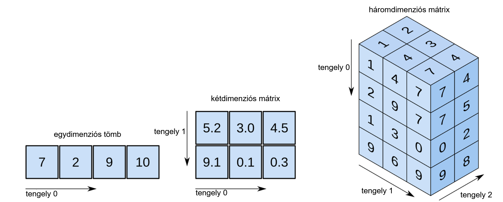
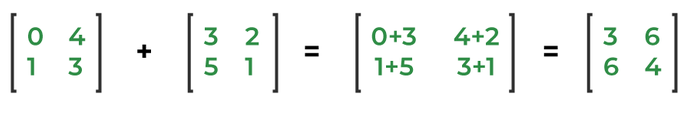
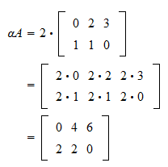
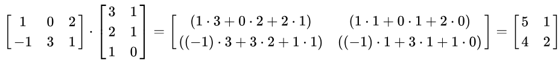
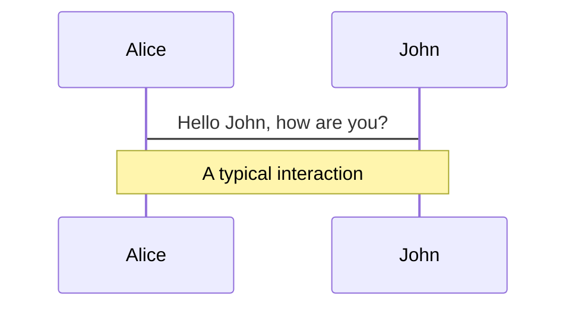
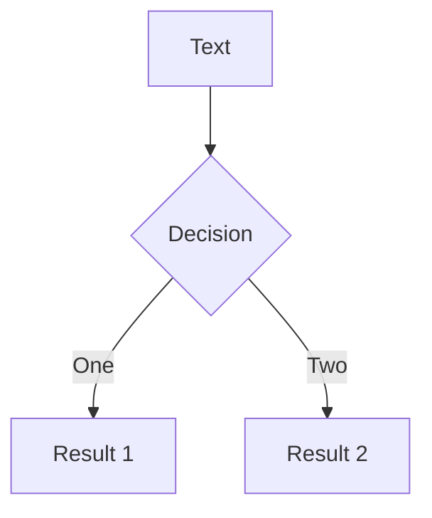
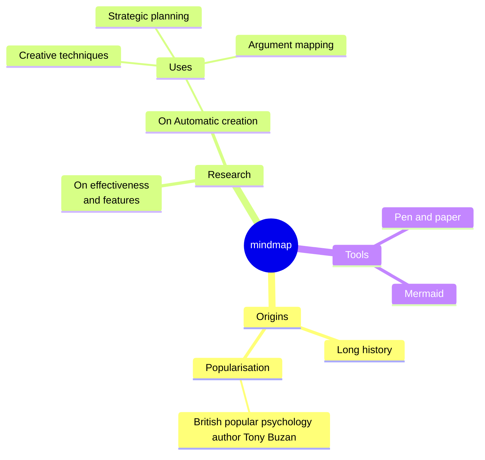
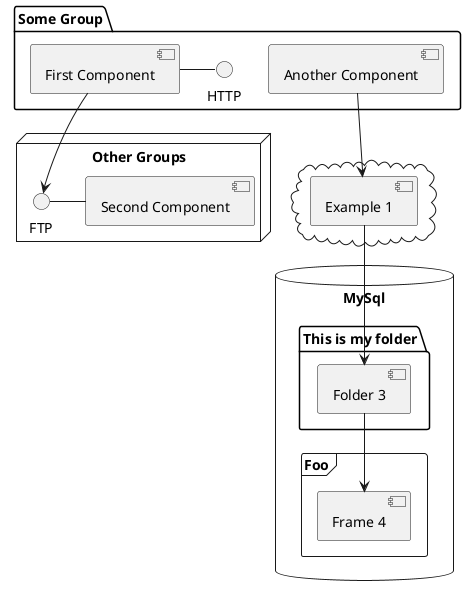

---
# You can also start simply with 'default'
theme: seriph
# random image from a curated Unsplash collection by Anthony
# like them? see https://unsplash.com/collections/94734566/slidev
background: "./img/math.jpg"
# some information about your slides (markdown enabled)
title: Mátrix szorzó program
# apply unocss classes to the current slide
class: text-center
# https://sli.dev/features/drawing
drawings:
  persist: false
# slide transition: https://sli.dev/guide/animations.html#slide-transitions
transition: fade-out
# enable MDC Syntax: https://sli.dev/features/mdc
mdc: true
---

# Mátrix szorzó program

## ...és ami mögötte van 

<div @click="$slidev.nav.next" class="mt-12 py-1" hover:bg="white op-10">
  Lássuk <carbon:arrow-right />
</div>

<div class="abs-br m-6 text-xl">
  <button @click="$slidev.nav.openInEditor" title="Open in Editor" class="slidev-icon-btn">
    <carbon:edit />
  </button>
  <a href="https://github.com/szankdav/matrix_szorzo_v2/tree/state-pattern" target="_blank" class="slidev-icon-btn">
    <carbon:logo-github />
  </a>
</div>

---
transition: fade-out
---

## A projekt célja

Ez a projekt tanulási céllal jött létre, melynek eredményeképp megismerkedhetünk a mátrixokkal, a velük végezhető műveletekkel, majd kiemelten ezek közül a szorzással. Ez után megnézzük mi az a State Pattern (állapot minta), amit követtünk a program létrehozása során. Végül megtudjuk, hogyan tudjuk használni a programot.

</img>
<div @click="$slidev.nav.next" class="mt-12 py-1 text-center" hover:bg="white op-10">
  Ez jól hangzik! <carbon:arrow-right />
</div>

---
level: 2
---

## Mi a mátrix?
<br>
Definíció:<br> 

"A mátrix a matematikában mennyiségek téglalap alakú elrendezése (táblázata). (Számoké, függvényeké, kifejezéseké, vagy egyéb elemeké, esetleg más mátrixoké; általánosan valamilyen gyűrű vagy vektortér elemeié)."
<br>

Forrás: <a href="https://hu.wikipedia.org/wiki/M%C3%A1trix_(matematika)" target="_blank">Wikipédia</a>
<br>

Érthetőbben:<br>

A mátrix nem más, mint egy táblázat, mely sorokból és oszlopokból áll. Egy n * m mátrix n sorból és m oszlopból épül fel. Ezt kétdimenziós mátrixnak nevezzük. Létezik háromdimenziós mátrix is, ami több kétdimenziós mátrix gyűjteménye. Ebben az esetben egy sor oszlopának az eleme egy újabb kétdimenziós mátrix lesz, aminek szintén vannak sorai és oszlopai.


<div @click="$slidev.nav.next" class="mt-12 py-1 text-center" hover:bg="white op-10">
  Képpel érthetőbb lesz <carbon:arrow-right />
</div>

---

Programozás során a mátrixokat tömbök segítségével hozzuk létre. Egy kétdimenziós mátrix egy olyan tömb, amiben a sorok számának megfelelő számú tömbök kapnak helyet. Egy háromdimenziós mátrix pedig egy olyan tömb, ahol minden sor egy kétdimenziós mátrixot tartalmazó tömb:

</img>
<div @click="$slidev.nav.next" class="mt-8 text-center" hover:bg="white op-10">
  Műveletek mátrixokkal<carbon:arrow-right />
</div>

---
class: mt-8
---

## Műveletek mátrixokkal

Most, hogy már tudjuk mi a mátrix, ismerkedjünk meg a műveletekkel, amiket két, vagy több mátrix felhasználásával végre tudunk hajtani:

<ul>
<li>Transzponálás</li>
<li>Összeadás</li>
<li>Skalárral való szorzás</li>
<li>Mátrixszorzás</li>
</ul>

Mi a programunkban az utolsót, azaz a mátrixszorzást mutatjuk be. De mielőtt ráténénk erre, ismerkedjünk meg a három másik elvégezhető művelettel!

<div @click="$slidev.nav.next" class="mt-12 py-1 text-center" hover:bg="white op-10">
  Transzponálás<carbon:arrow-right />
</div>

---

## Transzponálás

Egy mátrix transzponálása sorainak és oszlopainak felcsérélését jelenti. Kétszer végrehajtva visszakapjuk az eredeti mátrixot. A transzponálás jele: A<sup>T</sup>

</img>

<div @click="$slidev.nav.next" class="mt-8 text-center" hover:bg="white op-10">
  Összeadás<carbon:arrow-right />
</div>

---
class: mt-12
---
## Összeadás

Csak azonos dimenziójú mátrixok adhatóak össze. Legyen A és B két azonos dimenziójú, n * m-es méretű mátrix. Az A+B összeget úgy képezzük, hogy az azonos helyen lévő elemeket összegezzük: 

<div class="text-center mb-15 mt-10">
(A+B)[i,j] = (A)[i,j] + (B)[i,j]

</img>
</div>

<div @click="$slidev.nav.next" class="mt-8 text-center" hover:bg="white op-10">
  Skalárral való szorzás<carbon:arrow-right />
</div>

---

## Skalárral való szorzás

Egy A mátrix a skalárral való aA szorzatát úgy számoljuk, hogy A minden elemét megszorozzuk a a számmal:

<div class="text-center mb-8 mt-8">
(aA)[i,j] = a*(A)[i,j]

</img>
</div>

<div @click="$slidev.nav.next" class="text-center" hover:bg="white op-10">
  Mátrixszorzás<carbon:arrow-right />
</div>

---

## Mátrixszorzás

Két mátrix szorzata akkor definiált, ha a bal oldali mátrix oszlopai száma megegyezik a jobb oldali mátrix sorainak számával. Ha A egy n * m-es, B pedig egy m * k-s mátrix, mátrixszorzatuk egy n * k méretű AB mátrix lesz, melynek elemei így számíthatóak:

<div class="text-center mb-8 mt-8">
(AB)[i,j] = A[i,1] * B[1, j] + A[i, 2] * B[2, j] + ... + A[i, n] * B[n, j] 

</img>
</div>

A programunkban a fent olvasható módszert alkalmazva vagyunk képesek két mátrix szorzását elvégezni.

Minden műveletről részletesen olvashatunk a <a href="https://hu.wikipedia.org/wiki/M%C3%A1trix_(matematika)" target="_blank">Wikipédián</a>!

<div @click="$slidev.nav.next" class="mt-12 text-center" hover:bg="white op-10">
  A program<carbon:arrow-right />
</div>

---

## Mátrix szorzó

Most, hogy már tudjuk mi a mátrix, és milyen műveletek milyen módon végezhetőek mátrixokon, ismerkedjünk meg a programmal, ami két mátrix szorzását végzi el nekünk!

A program forráskódja letölhető a GitHub-ról:<br>
https://github.com/szankdav/matrix_szorzo_v2/tree/state-pattern

A readme.md fájl tartalmazza a szükséges lépéseket és információkat a futtatáshoz!

A program egy konzolos alkalmazás, ami azt jelenti, hogy a felhasználó a terminál segítségével tud bevinni adatokat, és a megjelenítés is itt történik. 

A programkód írása során a State Pattern-t, vagyis az állapot programtervezési követtük.

A következő diákon ezzel a programtervezési mintával ismerkedünk meg.

<div @click="$slidev.nav.next" class="mt-15 text-center" hover:bg="white op-10">
  Design Patterns - Programtervezési minták<carbon:arrow-right />
</div>

---

## Patternek, avagy programtervezési minták

Whoa-whoa-whoa, álljunk meg egy pillanatra. Többször mondtuk már, hogy State Pattern. De egyáltalán mi az?

A State Pattern egyike a számos programtervezési mintának (design patterns). A programtervezési minták (design patterns) olyan újrafelhasználható megoldások, melyek gyakori problémákat oldanak meg. Nem konkrét kódot, implementiációt kell érteni alatta, hanem egy útmutatót (paradigmát), mely az adott probléma megoldására kínál egy bejáratott megoldást. Forrás: <a href="https://mernokinformatikus.hu/tervezesi-mintak-a-gyakorlatban/" target="_blank">Tervezési minták</a>

A mi programunkban célként tűztük ki, hogy miután megtörtént a mátrixok szorzása, a program ne álljon le, hanem a felhasználónak legyen lehetősége újabb szorzás végrehajtására, egészen addig, amíg azt nem mondja, hogy vége, ki szeretnék lépni.

Ahelyett, hogy saját módszert alkottunk volna erre, egy létező paradigmát hívtunk segítségül:<br>
A State Pattern-t.

Ezzel garantálhatjuk, hogy azok a fejlesztők, akik ismerik ezeket a koncepciókat, könnyebben el tudnak igazodni a kódunkban, és nem kell kitalálniuk, hogy "mire gondolt a költő". Akik pedig nem ismerik ezeket, azoknak itt az ideje megismerkedni velük! :)

<div @click="$slidev.nav.next" class="text-center" hover:bg="white op-10">
  State Pattern - Állapot programtervezési minta<carbon:arrow-right />
</div>

---

## State Pattern - Állapot programtervezési minta

A kitekintés után térjünk vissza az általunk használt programtervezési mintához, a State Pattner-höz.

Említettük, hogy a programunkat úgy szerettük volna megírni, hogy egészen addig fusson, amíg a felhasználó azt nem mondja, hogy ő ki szeretne lépni. Hogyan oldanánk ezt meg, ha nem a programtervezési mintákhoz fordulnánk segítségért? Szerintem sok olvasóban már most felmerült a válasz: sok-sok if-else elágazással, esetleg switch-case-ekkel. Hiszen mindig ellenőriznünk kell, hogy a programunk éppen hol tart, mi történik éppen, és ez alapján kell a megfelelő irányba terelnünk a programunk futását.

A fő gondolat az, hogy egy adott pillanatban véges számú állapot van, amelyben a programunk lehet. Bármely egyedi állapoton belül a programunk másként viselkedik, és azonnal átkapcsolható egyik állapotból a másikba az if-else-ek segítségével.

Ez ahhoz fog vezetni, hogy a kódunk nagyon sok sorból fog állni, hiszen minden egyes lépés előtt ismét meg kell vizsgálnunk, hogy éppen mi történik, és ott helyben meg is kell mondanunk, hogy hogyan tovább. További állapotok implementálása növelni fogja az if-else elágazásunkat, a kód nehezen olvasható lesz, és a logika módosítása megváltoztathatja az if-else felétételeket, így karbantarthatóság szempontjából sem a legideálisabb ez a módszer.

<div @click="$slidev.nav.next" class="mt-5 text-center" hover:bg="white op-10">
  State Pattern - Állapot programtervezési minta<carbon:arrow-right />
</div>

---

## State Pattern - Állapot programtervezési minta

Tehát, hogyan is segít nekünk a State Pattern?

Az állapot minta szerint a legjobb, ha új osztályokat hozunk létre a programunk objektumainak összes lehetséges állapotához, és az összes állapotspecifikus viselkedést ezekben az osztályokban defíniáljuk. Ahelyett, hogy a viselkedéseket a program futtatására szolgáló fájlban valósítanánk meg, létrehozunk egy objektumot, amit kontextusnak nevezünk, ami eltárolja a hivatkozást az egyik állapotobjektumra, amely az aktuális állapotot reprezentálja, és az összes állapottal kapcsolatos munkát erre az állapotobjektumra delegálja.

Szóval, ahelyett, hogy a programunk aktuális állapotát if-else elágazások hadával felügyelnénk, állapotokat hozunk létre, és a programot mindig a megfelelő állapotban fogjuk futtatni. 

---

# Diagrams

You can create diagrams / graphs from textual descriptions, directly in your Markdown.

<div class="grid grid-cols-4 gap-5 pt-4 -mb-6">









</div>

Learn more: [Mermaid Diagrams](https://sli.dev/features/mermaid) and [PlantUML Diagrams](https://sli.dev/features/plantuml)

---
foo: bar
dragPos:
  square: 691,32,167,_,-16
---

# Draggable Elements

Double-click on the draggable elements to edit their positions.

<br>

###### Directive Usage

```md

```

<br>

###### Component Usage

```md
<v-drag text-3xl>
  <div class="i-carbon:arrow-up" />
  Use the `v-drag` component to have a draggable container!
</v-drag>
```

<v-drag pos="663,206,261,_,-15">
  <div text-center text-3xl border border-main rounded>
    Double-click me!
  </div>
</v-drag>


###### Draggable Arrow

```md
<v-drag-arrow two-way />
```

<v-drag-arrow pos="67,452,253,46" two-way op70 />

---
src: ./pages/imported-slides.md
hide: false
---

---

# Monaco Editor

Slidev provides built-in Monaco Editor support.

Add `{monaco}` to the code block to turn it into an editor:

```ts {monaco}
import { ref } from 'vue'
import { emptyArray } from './external'

const arr = ref(emptyArray(10))
```

Use `{monaco-run}` to create an editor that can execute the code directly in the slide:

```ts {monaco-run}
import { version } from 'vue'
import { emptyArray, sayHello } from './external'

sayHello()
console.log(`vue ${version}`)
console.log(emptyArray<number>(10).reduce(fib => [...fib, fib.at(-1)! + fib.at(-2)!], [1, 1]))
```

---
layout: center
class: text-center
---

# Learn More

[Documentation](https://sli.dev) · [GitHub](https://github.com/slidevjs/slidev) · [Showcases](https://sli.dev/resources/showcases)

<PoweredBySlidev mt-10 />
